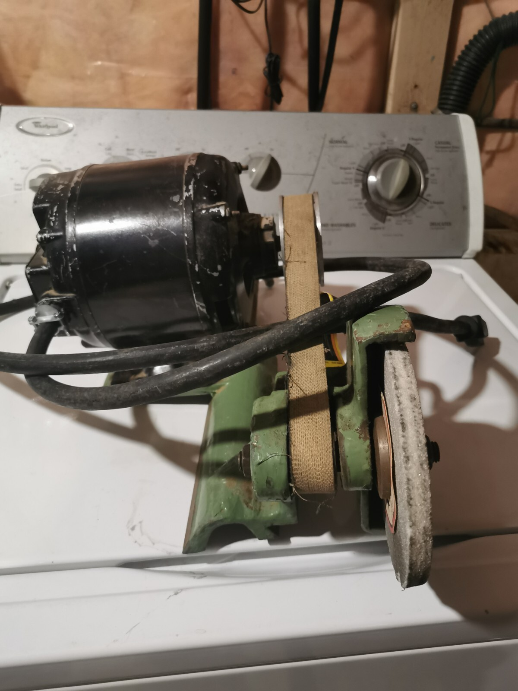

# South Bend Lathe Project

Please be on the lookout for the following missing lathe items.
The most interesting and immediately noticed items are towards the top
of the list, decreasing interest/importance towards the bottom.
* Taper cutting guide bar
* Saddle rear gib
* Tool post grinder
* Chuck key and jaws
* Lantern tool post
* Headstock lever and protecive covers
* Tailstock lever and wrench

# TAPER CUTTING GUIDE BAR

Top of the MOST WANTED list is the taper cutting guide bar. It is beyond
my ability to make a usable replacement and eBay listings are asking for
far too much money.

Here is the lathe as it sits today, with the taper-cutting extended cross-
slide but no guide bar to bolt to.

[eBay item #305826016397](https://www.ebay.com/itm/305826016397)
shows a lathe with the guide bar installed.

### Side Note

Even if the guide bar never turns up, that little wrench visible on the far
side is familiar. I remember seeing it on one of the organization cards.
When I gave you this card, you immediately said "This little wrench might
go with the lathe." You were right!

Okay, back to taper cutting guide bars.
[eBay item #167597136514](https://www.ebay.com/itm/167597136514)
is a guide bar by itself.

# SADDLE REAR GIB

The most functionally critical missing piece is the saddle rear gib. Here's
the back side of the saddle right now:

I searched for a picture to compare against, but apparently nobody ever take
pictures of a lathe's back side. All I can demonstrate is that without
the rear gib clamping the saddle to the bed, I can easily lift the saddle
into the air by hand.

Without the rear gib, this lathe can't perform lathe tasks.

[eBay item #396368311100](https://www.ebay.com/itm/396368311100)
shows what a rear gib looks like.

The bad news is that it is a very nondescript piece of metal.
Unlike for example the follow rest, nothing about its shape jumps out
as "Hey, I'm a lathe part!" against the background.

The good news is that, given its relatively simple nature, if it doesn't turn
up I can very likely make a functional replacement on my friend's Bridgeport
mill. And if I fail to make my own, eBay prices are tolerable.

# TOOL POST GRINDER

We know this one is around somewhere. I pulled it out of its case in your
garage and identified its purpose before putting it back in its box.
Unfortunately I no longer remember what the case looked like.

Here's an exploded view diagram I found online.

[eBay item #266681383700](https://www.ebay.com/itm/266681383700) is not
identical but exhibits the same general nature: a motor, a belt, a spindle with
grinding wheel, and no way for a human hand to hold it. This specific listed
item bolts to the machine in a different way.

# CHUCK KEY AND JAWS

The 3-jaw chuck has been cleaned up and is working smoothly. It is missing
its 1/4" square key, which I can make easily if it doesn't turn up.
What I can't make are the reverse jaws, which come with every 3-jaw chuck
from the factory and apparently quickly lost afterwards. I rarely see them in
secondhand sales. I doubt they'll show up but listing here for completeness.

[eBay item #316639410272](https://www.ebay.com/itm/316639410272)
has not just the key but also both sets of jaws! Probably because it is new
old stock still in box.

# LANTERN TOOL POST

The latern tool post is incomplete and require additional parts before
it is usable.

[eBay item #396725170535](https://www.ebay.com/itm/396725170535)
is a complete assembly showing what rest of the parts look like.

If the missing parts turn up, great! If they don't, no matter! If I succeed in
getting this lathe running I will likely buy either a turrent tool post or a
quick-change tool post so I can switch cutters far faster than using this
single-tool holder.

Or maybe another tool post will show up, which would be great.

# HEADSTOCK LEVER AND COVERS

The headstock as it sits today is missing several parts. Including the motor
belt engage/disengage lever, and covers protecting squishy humans from teeth
of spinning gears.

Here's what the missing pieces look like, again from
[eBay item #305826016397](https://www.ebay.com/itm/305826016397).

These are also listed purely so you know what they are if you see them. I
don't care whether they turn up or not, because I plan to retrofit a modern
motor. Which will require a different mount and hence that lever won't be
applicable. I can create plastic protective covers with my 3D printer.

# TAILSTOCK LEVER AND WRENCH

The tailstock is missing its binding lever and wrench.
[eBay item #388532726719](https://www.ebay.com/itm/388532726719)
shows the complete assembly.

The wrench is nothing special, I can use a generic wrench to turn that hex nut.

The binding lever is attached to a threaded rod extending inside the tailstock
to clamp on spindle. I can make a replacement and if not, as a last resort I
can use a generic hex bolt.

---

### Hopefully that's everything but if I find more I'll add them here.
